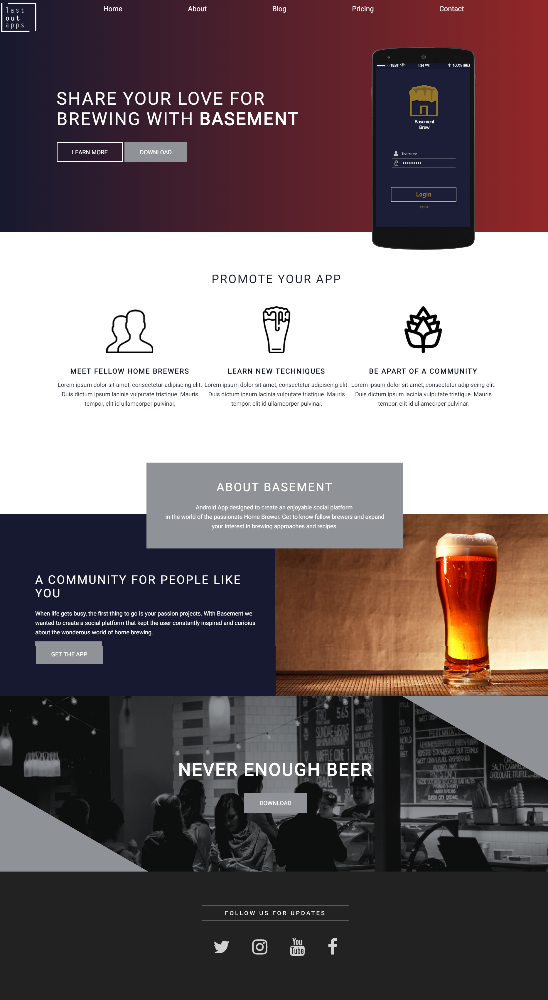

## BurnSite
This project is a static website example
using the FlexboxGrid framework and sass.

## ScreenShot


# Installation
Clone the project:

```bash
git clone https://github.com/123Fives/BurnSite.git
```

## Requiriments to Understand this Project
- FrontEnd Basics: HTML5 + CSS3
- Sass preprocessor CSS3
- Responsive UI/UX Design

## Tools
- Prepros
- Git
- Atom.io
- Photoshop

